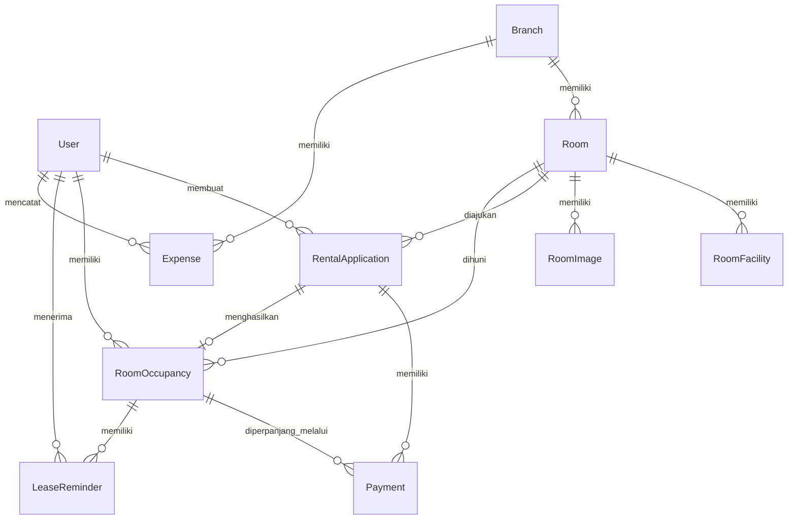

# ERD Business KosHandayani

Dokumen ini adalah versi ERD bisnis untuk laporan PBL. Isinya hanya entitas domain KosHandayani dan tidak memasukkan tabel framework Laravel seperti cache, jobs, sessions, password reset, atau personal access tokens.

## Ringkasan

Jumlah entitas bisnis: 10

Jumlah relasi bisnis utama: 14

Entitas utama:

- User
- Branch
- Room
- Rental Application
- Payment
- Room Occupancy

Entitas pendukung bisnis:

- Room Facility
- Room Image
- Lease Reminder
- Expense

## Entitas Bisnis

## User

Deskripsi:
Pengguna sistem. User dapat berperan sebagai tenant atau owner.

Peran bisnis:

- Tenant membuat pengajuan sewa, melakukan pembayaran, dan menerima pengingat masa sewa.
- Owner mengelola data kamar, melihat laporan, memproses pengajuan, dan mencatat pengeluaran.

Relasi:

- User membuat banyak Rental Application.
- User memiliki banyak Room Occupancy.
- User menerima banyak Lease Reminder.
- User mencatat banyak Expense sebagai owner.

## Branch

Deskripsi:
Cabang atau lokasi kos.

Peran bisnis:

- Mengelompokkan kamar berdasarkan lokasi.
- Menjadi dasar pencatatan pengeluaran dan laporan per cabang.

Relasi:

- Branch memiliki banyak Room.
- Branch memiliki banyak Expense.

## Room

Deskripsi:
Kamar kos yang ditawarkan kepada tenant.

Peran bisnis:

- Menjadi objek yang disewa tenant.
- Memiliki harga, status ketersediaan, fasilitas, gambar, dan cabang.

Relasi:

- Room berada pada satu Branch.
- Room memiliki banyak Room Facility.
- Room memiliki banyak Room Image.
- Room dapat muncul pada banyak Rental Application.
- Room dapat memiliki banyak Room Occupancy sepanjang waktu.

## Room Facility

Deskripsi:
Fasilitas yang dimiliki kamar.

Peran bisnis:

- Membantu tenant memahami fasilitas kamar sebelum mengajukan sewa.

Relasi:

- Room Facility dimiliki oleh satu Room.

## Room Image

Deskripsi:
Foto kamar.

Peran bisnis:

- Menampilkan kondisi visual kamar kepada tenant.
- Satu gambar dapat ditandai sebagai gambar utama.

Relasi:

- Room Image dimiliki oleh satu Room.

## Rental Application

Deskripsi:
Pengajuan sewa kamar oleh tenant.

Peran bisnis:

- Menjadi tahap awal proses sewa.
- Berisi pilihan kamar, tanggal masuk, durasi sewa, dokumen, status review owner, dan status pembayaran.

Relasi:

- Rental Application dibuat oleh satu User.
- Rental Application memilih satu Room.
- Rental Application memiliki banyak Payment.
- Rental Application dapat menghasilkan satu Room Occupancy setelah pembayaran berhasil.

## Payment

Deskripsi:
Pembayaran sewa awal atau pembayaran perpanjangan sewa.

Peran bisnis:

- Mencatat transaksi pembayaran tenant.
- Menyimpan status pembayaran dari Midtrans.
- Menjadi dasar pembentukan hunian atau perpanjangan masa sewa.

Relasi:

- Payment dimiliki oleh satu Rental Application.
- Payment perpanjangan dapat terhubung ke satu Room Occupancy.

## Room Occupancy

Deskripsi:
Data hunian tenant pada kamar tertentu.

Peran bisnis:

- Menandai bahwa tenant sedang atau pernah menempati kamar.
- Menyimpan periode mulai dan akhir masa sewa.
- Menjadi dasar pengingat dan perpanjangan masa sewa.

Relasi:

- Room Occupancy dimiliki oleh satu User.
- Room Occupancy berada pada satu Room.
- Room Occupancy berasal dari satu Rental Application.
- Room Occupancy memiliki banyak Payment perpanjangan.
- Room Occupancy memiliki banyak Lease Reminder.

## Lease Reminder

Deskripsi:
Riwayat pengingat masa sewa yang dikirim kepada tenant.

Peran bisnis:

- Mencegah tenant lupa masa akhir sewa.
- Mencatat pengingat yang sudah dikirim agar tidak terkirim berulang untuk periode yang sama.

Relasi:

- Lease Reminder dimiliki oleh satu Room Occupancy.
- Lease Reminder dikirim kepada satu User.

## Expense

Deskripsi:
Pengeluaran operasional cabang.

Peran bisnis:

- Mencatat biaya perawatan, utilitas, internet, kebersihan, keamanan, perlengkapan, pajak, dan pengeluaran lain.
- Digunakan dalam laporan keuangan owner.

Relasi:

- Expense terjadi pada satu Branch.
- Expense dicatat oleh satu User owner.

## Relasi Bisnis

| Entitas A | Relasi | Entitas B | Kardinalitas |
| --------- | ------ | --------- | ------------ |
| User | membuat | Rental Application | 1:N |
| User | memiliki histori | Room Occupancy | 1:N |
| User | menerima | Lease Reminder | 1:N |
| User | mencatat | Expense | 1:N |
| Branch | memiliki | Room | 1:N |
| Branch | memiliki | Expense | 1:N |
| Room | memiliki | Room Facility | 1:N |
| Room | memiliki | Room Image | 1:N |
| Room | diajukan dalam | Rental Application | 1:N |
| Room | dihuni dalam | Room Occupancy | 1:N |
| Rental Application | memiliki | Payment | 1:N |
| Rental Application | menghasilkan | Room Occupancy | 1:0..1 |
| Room Occupancy | memiliki pembayaran perpanjangan | Payment | 1:N |
| Room Occupancy | memiliki | Lease Reminder | 1:N |

## Crow's Foot Source Bisnis

## Alur Bisnis Utama

User tenant memilih Room yang berada pada Branch tertentu.

Tenant membuat Rental Application untuk kamar tersebut.

Owner meninjau Rental Application dan menyetujui atau menolak.

Jika disetujui, tenant membuat Payment awal.

Jika Payment awal berhasil, sistem membuat Room Occupancy.

Sistem mengirim Lease Reminder ketika masa sewa mendekati akhir.

Tenant dapat membuat Payment perpanjangan.

Jika Payment perpanjangan berhasil, masa akhir Room Occupancy diperpanjang.

Owner mencatat Expense untuk kebutuhan operasional Branch dan melihat laporan.

## Catatan Untuk Laporan PBL

- User adalah aktor utama sistem.
- Room adalah objek yang disewakan.
- Rental Application adalah proses pengajuan.
- Payment adalah proses transaksi.
- Room Occupancy adalah hasil dari transaksi sewa yang berhasil.
- Lease Reminder mendukung keberlanjutan sewa.
- Expense mendukung laporan operasional owner.
