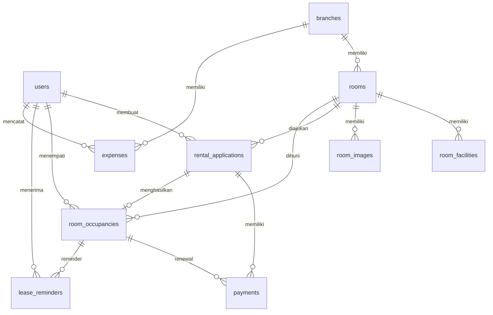

# ERD Draw.io Ready KosHandayani

Dokumen ini adalah panduan siap gambar untuk Draw.io, Mermaid, dbdiagram.io, atau alat diagram lain. Fokusnya adalah ERD Crow's Foot dan Chen Diagram.

## Daftar Entitas Utama Yang Harus Digambar

Entitas inti proses sewa:

- users
- branches
- rooms
- rental_applications
- payments
- room_occupancies

Alasan:

- Entitas ini membentuk alur bisnis utama dari akun, lokasi, kamar, pengajuan, pembayaran, sampai hunian.

## Daftar Entitas Pendukung

Entitas pendukung kamar:

- room_facilities
- room_images

Entitas pendukung operasional:

- lease_reminders
- expenses

Entitas framework Laravel tidak perlu digambar untuk laporan PBL bisnis:

- personal_access_tokens
- password_reset_tokens
- sessions
- cache
- cache_locks
- jobs
- job_batches
- failed_jobs

Jika diagram ditujukan untuk audit teknis database lengkap, tabel framework dapat ditambahkan dari `docs/ERD.md`.

## Layout Rekomendasi Crow's Foot

Gunakan layout kiri ke kanan.

Area kiri:

- users
- branches

Area tengah:

- rooms
- rental_applications

Area kanan:

- payments
- room_occupancies

Area atas atau bawah rooms:

- room_facilities
- room_images

Area bawah room_occupancies:

- lease_reminders

Area bawah branches:

- expenses

Susunan visual:

```text
                         room_facilities
                              |
branches ---- rooms ---- rental_applications ---- payments
   |             |                |                    |
expenses     room_images          |                    |
                                room_occupancies ------+
                                      |
users -------------------------------+
                                      |
                                lease_reminders
```

Catatan layout:

- Letakkan `rental_applications` di tengah karena menjadi jembatan antara user, room, payment, dan occupancy.
- Letakkan `room_occupancies` dekat `payments` karena pembayaran renewal terhubung ke hunian.
- Letakkan `expenses` dekat `branches` dan `users` karena expense terjadi pada cabang dan dibuat oleh owner.
- Letakkan `room_facilities` dan `room_images` menempel pada `rooms` karena keduanya detail kamar.

## Layout Rekomendasi Chen Diagram

Gunakan nama entitas bisnis, bukan nama tabel database.

Tengah diagram:

- Pengajuan Sewa
- Pembayaran
- Hunian Kamar

Kiri diagram:

- User

Atas diagram:

- Cabang
- Kamar

Sekitar Kamar:

- Fasilitas Kamar
- Gambar Kamar

Kanan diagram:

- Pengingat Sewa

Bawah diagram:

- Pengeluaran

Relasi Chen yang perlu dibuat sebagai belah ketupat:

- membuat
- memilih
- memiliki
- dibayar melalui
- menghasilkan
- menempati
- diperpanjang melalui
- menerima
- mencatat

## Hubungan Antar Entitas Crow's Foot

| Dari | Ke | Kardinalitas | Label Relasi |
| ---- | -- | ------------ | ------------ |
| users | rental_applications | 1:N | membuat |
| users | room_occupancies | 1:N | menempati |
| users | lease_reminders | 1:N | menerima |
| users | expenses | 1:N | mencatat |
| branches | rooms | 1:N | memiliki |
| branches | expenses | 1:N | memiliki |
| rooms | room_facilities | 1:N | memiliki |
| rooms | room_images | 1:N | memiliki |
| rooms | rental_applications | 1:N | diajukan dalam |
| rooms | room_occupancies | 1:N | dihuni dalam |
| rental_applications | payments | 1:N | memiliki |
| rental_applications | room_occupancies | 1:0..1 | menghasilkan |
| room_occupancies | payments | 1:N | pembayaran perpanjangan |
| room_occupancies | lease_reminders | 1:N | memiliki |

## Hubungan Antar Entitas Chen

| Entitas A | Relasi Chen | Entitas B | Kardinalitas |
| --------- | ----------- | --------- | ------------ |
| User | membuat | Pengajuan Sewa | 1:N |
| User | menempati | Hunian Kamar | 1:N |
| User | menerima | Pengingat Sewa | 1:N |
| User | mencatat | Pengeluaran | 1:N |
| Cabang | memiliki | Kamar | 1:N |
| Cabang | memiliki | Pengeluaran | 1:N |
| Kamar | memiliki | Fasilitas Kamar | 1:N |
| Kamar | memiliki | Gambar Kamar | 1:N |
| Kamar | dipilih dalam | Pengajuan Sewa | 1:N |
| Kamar | ditempati dalam | Hunian Kamar | 1:N |
| Pengajuan Sewa | dibayar melalui | Pembayaran | 1:N |
| Pengajuan Sewa | menghasilkan | Hunian Kamar | 1:0..1 |
| Hunian Kamar | diperpanjang melalui | Pembayaran | 1:N |
| Hunian Kamar | memiliki | Pengingat Sewa | 1:N |

## Entitas dan Atribut Untuk Crow's Foot

Gunakan nama tabel dan kolom penting berikut agar diagram tetap mudah dibaca.

users:

- id
- name
- email
- role
- phone
- profile_completed

branches:

- id
- branch_name
- city
- address

rooms:

- id
- branch_id
- room_name
- price
- gender_type
- room_status
- is_available

room_facilities:

- id
- room_id
- facility_name

room_images:

- id
- room_id
- image_url
- is_primary

rental_applications:

- id
- user_id
- room_id
- move_in_date
- duration
- status
- payment_status

payments:

- id
- rental_application_id
- room_occupancy_id
- payment_category
- gross_amount
- transaction_status
- paid_at

room_occupancies:

- id
- user_id
- room_id
- rental_application_id
- start_date
- end_date
- status

lease_reminders:

- id
- room_occupancy_id
- user_id
- channel
- reminder_type
- sent_at

expenses:

- id
- branch_id
- created_by
- category
- amount
- expense_date

## Entitas dan Atribut Untuk Chen Diagram

Gunakan nama bisnis dan atribut bisnis berikut.

User:

- Nama
- Email
- Nomor telepon
- Role
- Status profil

Cabang:

- Nama cabang
- Kota
- Alamat

Kamar:

- Nama kamar
- Harga sewa
- Tipe penghuni
- Status kamar
- Ketersediaan

Fasilitas Kamar:

- Nama fasilitas

Gambar Kamar:

- Foto kamar
- Foto utama

Pengajuan Sewa:

- Tanggal mulai
- Durasi
- Dokumen identitas
- Status pengajuan
- Status pembayaran

Pembayaran:

- Kategori pembayaran
- Nominal
- Diskon
- Metode pembayaran
- Status transaksi
- Periode pembayaran

Hunian Kamar:

- Tanggal mulai hunian
- Tanggal akhir hunian
- Status hunian

Pengingat Sewa:

- Media pengiriman
- Jenis pengingat
- Waktu pengiriman

Pengeluaran:

- Kategori
- Nominal
- Tanggal pengeluaran
- Bukti pengeluaran

## Mermaid Cepat Untuk Draw.io



## Checklist Menggambar

- [ ] Gambar 10 entitas domain.
- [ ] Pisahkan entitas utama dan pendukung.
- [ ] Pakai nama tabel untuk Crow's Foot.
- [ ] Pakai nama bisnis untuk Chen Diagram.
- [ ] Tambahkan primary key dan foreign key pada Crow's Foot.
- [ ] Tambahkan atribut bisnis berbentuk oval pada Chen Diagram.
- [ ] Pastikan semua relasi 1:N dan 1:0..1 tergambar.
- [ ] Jangan masukkan tabel framework Laravel untuk laporan PBL bisnis.
- [ ] Letakkan Pengajuan Sewa, Pembayaran, dan Hunian Kamar sebagai pusat alur.
